# Jesus Gael Carrasco Avitia 6 J

en lenguaje dart flutter crea una pagina con la base de un header rojo con en nombre spidey saurus en la parte izquierda, y en la parte derecha un icono de account, una barra de navegacion amarilla con los links de paginas inicio, productos y conocenos centrados en texto color negro, un footer blanco con una pequeña imagen web centrada y debajo un texto que diga "jesus gael carrasco avitia", y que todo el body sea de color negro, comenzando con las diferentes paginas en la del inicio tendra un texto centrado en la parte superior y abajo del texto una imagen web, en la pagina de productos se creara una barra de navegacion nueva bajo la principal con los links de "juguetes, estatuas, promocionales y ropa" de color naranja y letras negras, cada pagina mostrara 4 tarjetas con una imagen web un nombre debajo y un boton rojo de comprar, cada tarjeta sera independiente una de otra para poder cambiar los nombres e imagenes estas tarjetas estaran distribuidas en 2 columnas excepto en la pagina de ropa que solo sera una columna, y en la pagina conocenos estara un recuadro rojo con texto color negro dentro de el.
quiero que dividas el codigo en diferentes archivos "main, inicio, juguetes, estatuas, promocionales, ropa y conócenos"

6 pantallas Web

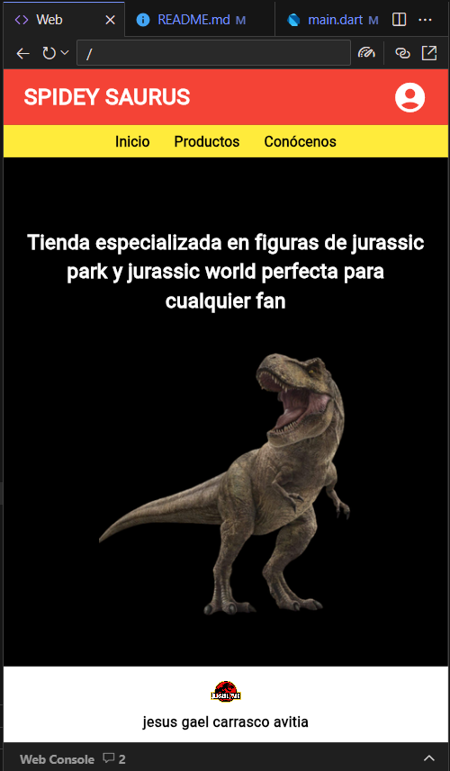
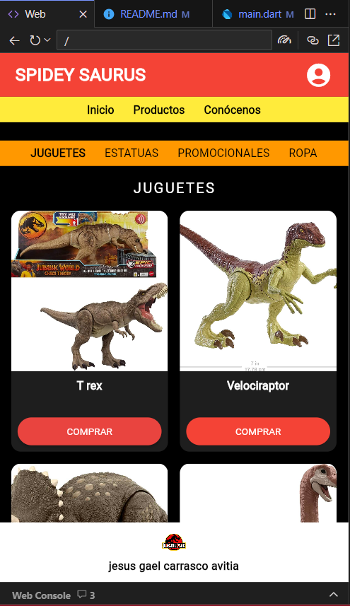
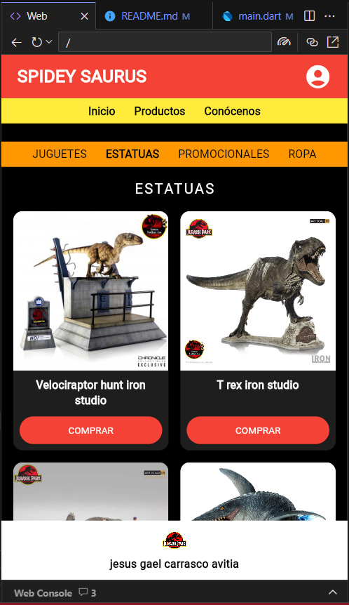
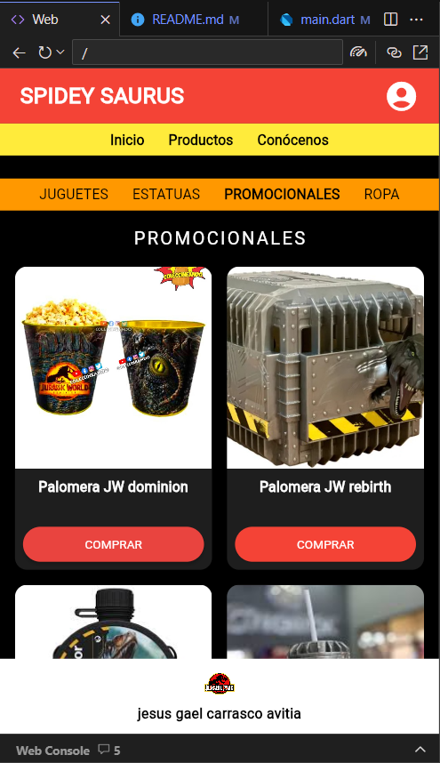
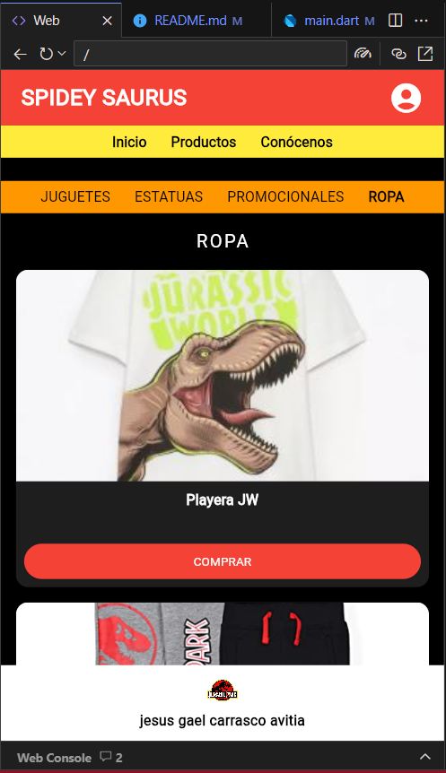
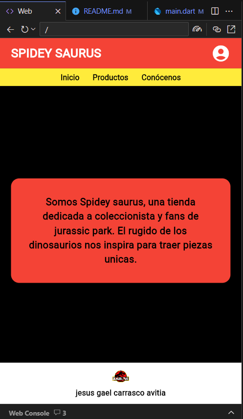

6 pantallas Android

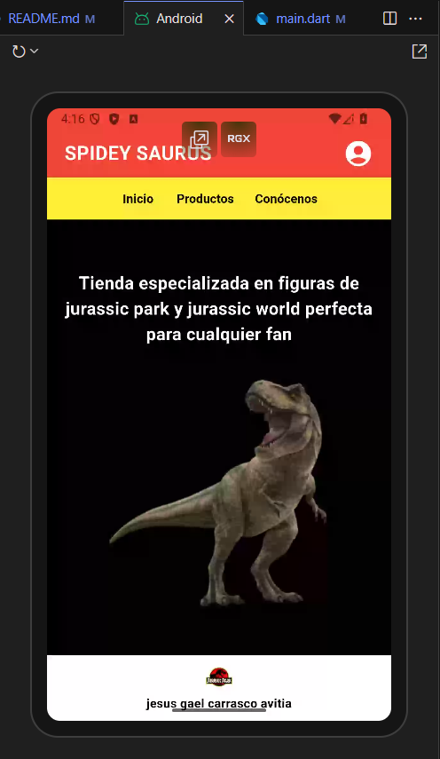
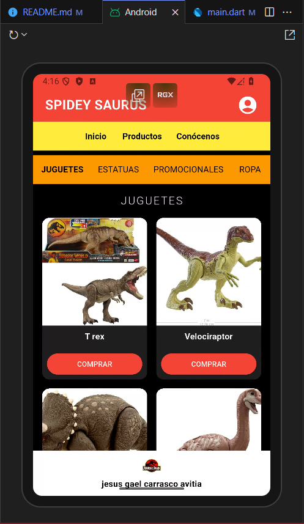
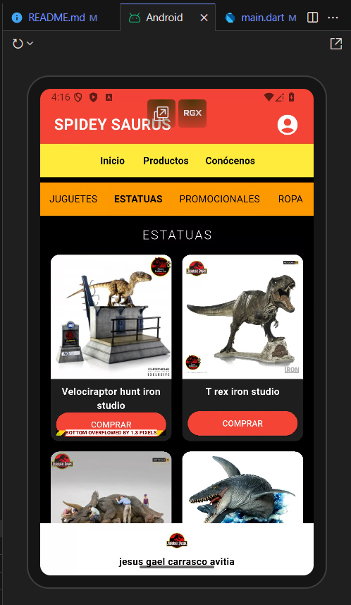
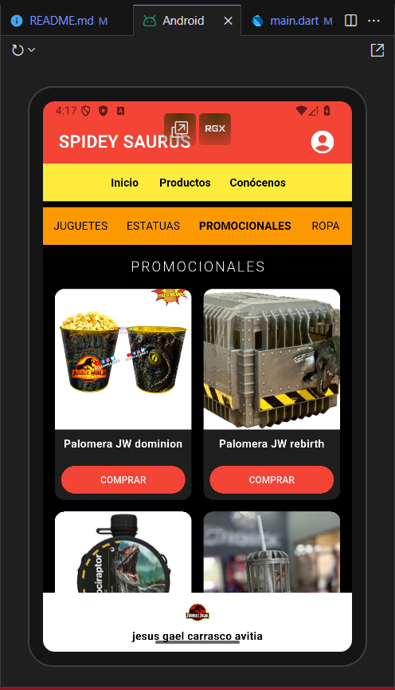
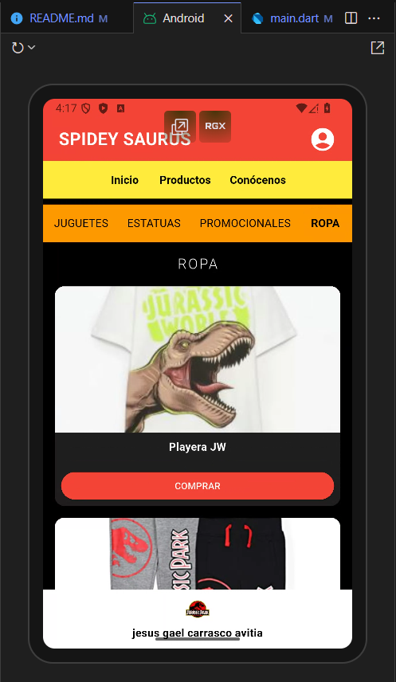
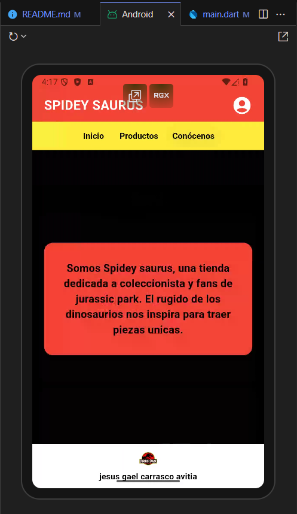